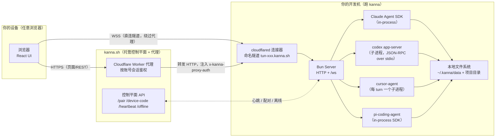
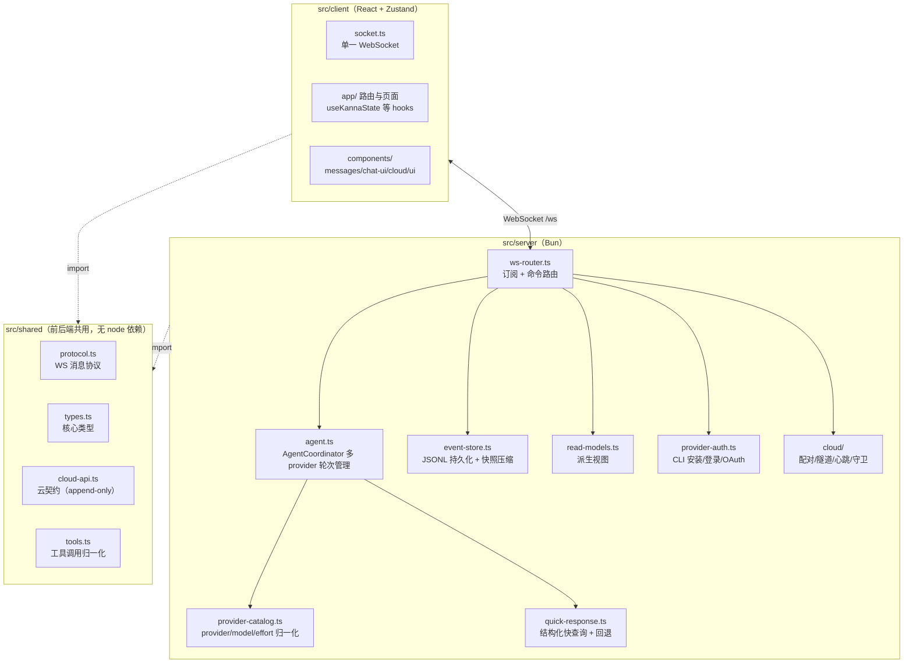
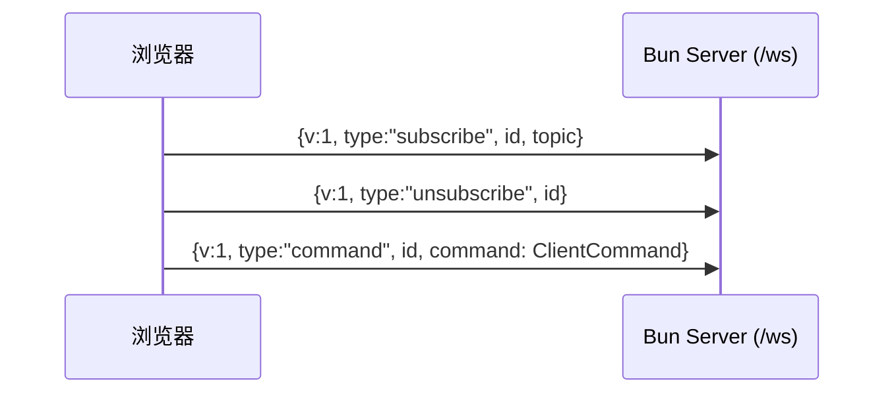
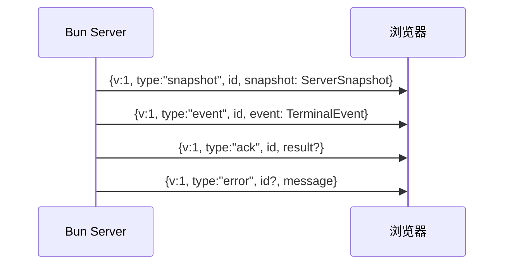
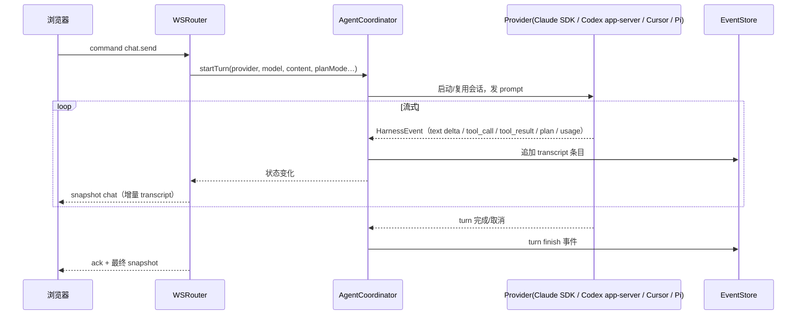
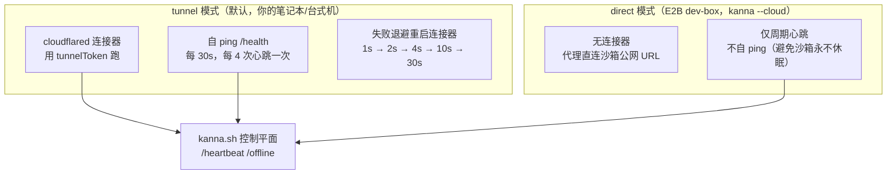
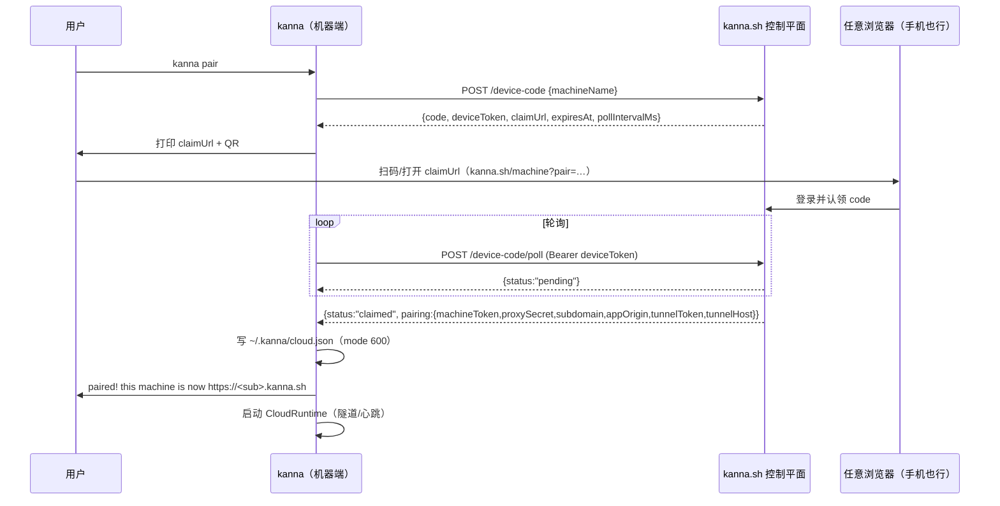
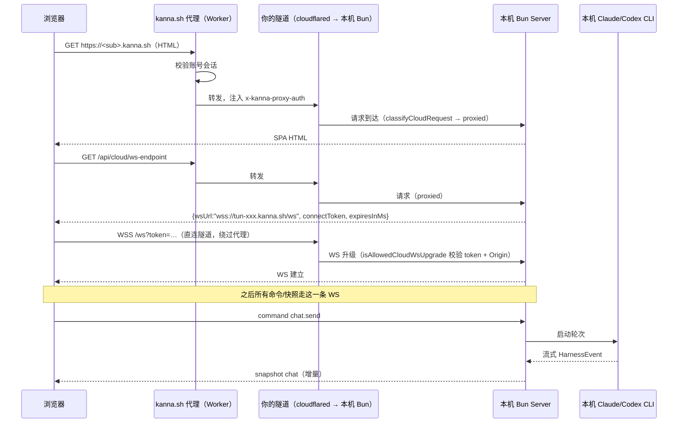

# Kanna 项目说明

> Kanna（npm 包名 `kanna-code`）是一个跑在你自己机器上的 Bun HTTP + WebSocket 服务器，外加 React 19 浏览器前端，用于驱动 Claude Code、Codex、Cursor、Pi 这几个 coding agent CLI。本文档基于对源码的逐文件阅读整理，重点回答：Kanna 是如何把 Codex 与 Claude Code “放到云端”的、用了什么协议（是不是 ACP）、是否支持会员计划/API Key、是否继承本地配置、是否支持环境变量。

---

## 1. 一句话定位

Kanna 本身 **不托管、不代理、不重写** 任何 LLM 流量。所有 LLM 调用都由本机已安装的 Claude Code / Codex / Cursor / Pi CLI 直接发起，Kanna 只是把它们的输入输出“翻译”成统一的 `HarnessEvent` 流并渲染到网页上。

所谓“放到云端”，准确说法是：**Kanna 通过 Cloudflare 命名隧道（cloudflared）或 E2B 直连模式，把你这台机器上跑着的 Kanna 服务器暴露成一个 `https://<sub>.kanna.sh` 的公网地址**。浏览器从任何设备访问该地址，WebSocket 直连回你本机的 Kanna，再由本机的 Kanna 调用本机的 Claude/Codex CLI。LLM 凭证、会话状态、文件系统访问全部留在你本机——Kanna Cloud 只是一个“反向隧道 + 鉴权代理 + 控制平面”，不接触模型流量。



关键点：

- **页面与 REST 走 kanna.sh 代理**（代理用账号会话鉴权，再注入 `x-kanna-proxy-auth` 共享密钥转发到你的隧道）。
- **WebSocket 不走代理**：浏览器先经代理调 `/api/cloud/ws-endpoint` 拿到隧道直连 URL + 短期 connect token，然后 `wss://tun-xxx.kanna.sh/ws?token=…` 直接连到你的机器。这样实时流不经过 Cloudflare Worker，规避 Worker 不支持长连 WS 帧的问题。
- **模型流量** 全部由本机 CLI 发起，Kanna Cloud 完全不参与。

---

## 2. 整体架构



设计模式（README + 源码）：

- **事件溯源**：所有状态变更以 append-only JSONL 写入 `~/.kanna/data/`。
- **CQRS**：写路径是事件日志，读路径是 `read-models.ts` 派生的快照。
- **响应式广播**：客户端订阅 topic（`sidebar`/`chat`/`project-git`/…），服务器在状态变化时按 topic 推送快照，并用签名去重。

## 3. 目录与文件作用

### 3.1 顶层

| 路径 | 作用 |
| --- | --- |
| `bin/kanna` | npm 全局安装后的入口脚本，转发到 `src/server/cli.ts`。 |
| `package.json` | 包名 `kanna-code`；依赖 `@anthropic-ai/claude-agent-sdk`、`@mariozechner/pi-coding-agent`、`@mariozechner/pi-ai`、`openai`、`cloudflared`、`uqr` 等。 |
| `index.html` | Vite SPA 入口。 |
| `vite.config.ts` / `vite.export-viewer.config.ts` | 前端构建；后者用于“独立 transcript 查看器”产物。 |
| `scripts/dev.ts` | 同时拉起 Vite 客户端 + Bun 后端。 |
| `scripts/dev-server.ts` | 仅后端开发模式。 |
| `scripts/record-claude-fixture.ts` | 录制 Claude SDK fixture。 |
| `docs/` | `package-split.md`（包拆分计划）、`refactor-todo.md`。 |
| `CLAUDE.md` | 给 Claude Code 自己看的项目约定。 |

### 3.2 `src/shared/`（前后端共用，禁止 node 导入）

| 文件 | 作用 |
| --- | --- |
| `protocol.ts` | **WebSocket 线协议**：`ClientEnvelope`（subscribe/unsubscribe/command）、`ServerEnvelope`（snapshot/event/ack/error）、`SubscriptionTopic`、`ClientCommand` 全集。新增 WS 命令必须改这里 + `ws-router.ts`。 |
| `types.ts` | 核心数据类型：`TranscriptEntry`、`AgentProvider`、provider catalog、`LlmProviderSnapshot`、`ProviderAuthSnapshot`、`AppSettingsSnapshot` 等。 |
| `cloud-api.ts` | **Kanna Cloud 线契约**（append-only，与私有仓库 `kanna-site` 逐字镜像）。定义控制平面 URL、`PROXY_AUTH_HEADER`、`CLOUD_WS_ENDPOINT_PATH`、`/pair`、`/device-code`、`/heartbeat`、`/offline` 等请求/响应。 |
| `tools.ts` | 工具调用归一化：把各 provider 的工具调用映射成 `NormalizedToolCall`（`toolKind` 如 `bash`/`write_file`/`edit_file`/`ask_user_question`/`exit_plan_mode`…）。 |
| `branding.ts` | 应用名 `Kanna`、CLI 命令 `kanna`、数据根 `~/.kanna`、各配置文件路径（`cloud.json`/`llm-provider.json`/`settings.json`/`keybindings.json`）。 |
| `provider-preferences.ts` | 各 provider 默认模型/effort 偏好合并。 |
| `share.ts` | `--share` / `--cloudflared` 共享隧道模式类型。 |
| `ports.ts` / `dev-ports.ts` | 端口常量（生产 3210）。 |
| `git-url.ts` / `message-preview.ts` / `json.ts` / `assert.ts` / `analytics.ts` | 小工具。 |

### 3.3 `src/server/`（Bun 后端，核心）

**入口与服务器**

| 文件 | 作用 |
| --- | --- |
| `cli.ts` | 进程入口；读版本，调 `runCli`，处理更新重启退出码。 |
| `cli-runtime.ts` | **CLI 主循环**：解析参数（`--port/--host/--remote/--share/--cloudflared/--password/--no-cloud/--cloud`）、自更新、读 `cloud.json`、单实例探测、按需创建 `CloudRuntime`、启动服务器、启动隧道/云运行时、打开浏览器。`kanna pair` 子命令路由到 `cloud/pair-command.ts`。 |
| `server.ts` | **HTTP/WS 服务器装配**：`Bun.serve`、路由分发、`/health`、`/auth/*`、`/api/cloud/ws-endpoint`、`/api/cloud/pair-session`、上传/附件、静态资源；按 `classifyCloudRequest` 把请求分类为 `proxied/local/untrusted`，未信任的原始隧道流量只暴露 `/health` 和 token 门禁的 `/ws`。 |
| `ws-router.ts` | **WebSocket 命令路由与快照订阅**：处理 `ClientCommand`、按 topic 广播快照、签名去重、增量 transcript 推送、命令 ack。 |
| `instance.ts` | 单实例探测（同数据目录二次启动直接复用）。 |
| `restart.ts` | 更新后重启退出码协议。 |

**Agent 协调（多 provider）**

| 文件 | 作用 |
| --- | --- |
| `agent.ts` | **AgentCoordinator**：管理活跃轮次、Claude 会话生命周期、跨 provider 切换、plan mode、auto plan、steer/queue、标题生成、会话产物校验。Claude 走 `@anthropic-ai/claude-agent-sdk` 的 `query()`（in-process）。 |
| `codex-app-server.ts` | **Codex 适配器**：spawn `codex app-server` 子进程，用 JSON-RPC over stdio 驱动 `initialize` / `thread/start` / `thread/resume` / `thread/fork` / `turn/start` / `turn/interrupt`，把 codex 的 `ThreadItem`/通知翻译成 `HarnessEvent`。 |
| `codex-app-server-protocol.ts` | 从 `codex app-server generate-ts` vendored 的协议子集类型。 |
| `cursor-cli.ts` | **Cursor 适配器**：每个 turn spawn `cursor-agent -p --output-format stream-json --force --model …`，解析 NDJSON 流。鉴权靠 `CURSOR_API_KEY` 环境变量。 |
| `pi-agent.ts` | **Pi 适配器**：通过 `@mariozechner/pi-coding-agent` SDK in-process 驱动；凭证走 Kanna 的 Model Registry（OpenRouter/OpenAI/自定义 OpenAI 兼容端点），`OPENROUTER_API_KEY` 是 env 兜底。 |
| `harness-types.ts` | `HarnessEvent` / `HarnessTurn` / `HarnessToolRequest` 统一中间表示。 |
| `harness-skills.ts` | 跨 provider 的 skill 发现与系统消息拼接。 |
| `provider-catalog.ts` | provider/model/effort 归一化；用 SDK 的 `supportedModels()` 动态重建 Claude picker。 |
| `quick-response.ts` | 结构化快查询（标题生成等）：Claude Haiku 优先，Codex/OpenAI 回退。 |
| `attribution.ts` | 给 Claude 系统提示追加 Kanna 归因指令。 |
| `handoff.ts` | 跨 provider 交接上下文。 |
| `session-artifacts.ts` | 会话产物存在性校验。 |
| `generate-title.ts` / `generate-commit-message.ts` | 后台标题/提交信息生成。 |

**持久化与派生视图**

| 文件 | 作用 |
| --- | --- |
| `event-store.ts` | **JSONL 事件存储**：`projects.jsonl`/`chats.jsonl`/`messages.jsonl`/`turns.jsonl` + `snapshot.json` 压缩；LRU transcript 缓存；启动时回放尾部日志。 |
| `transcript.ts` | 给 transcript 条目盖时间戳。 |
| `read-models.ts` | 从事件状态派生 `SidebarData`/`ChatSnapshot`/`LocalProjectsSnapshot`。 |
| `diff-store.ts` | git 客户端：diff 快照、分支、提交、PR 发布。 |
| `worktree-probe.ts` / `worktree-snapshot.ts` / `touched-file-backfill.ts` | 工作树脏文件探测、轮次文件快照、回填。 |
| `discovery.ts` | 从 Claude 与 Codex 本地历史自动发现项目。 |
| `paths.ts` | 路径解析、克隆仓库、创建目录。 |
| `uploads.ts` | 项目上传文件持久化。 |
| `share.ts` | `--share` Cloudflare quick tunnel / `--cloudflared <token>` 命名隧道。 |
| `standalone-export.ts` | 导出 standalone transcript HTML。 |

**鉴权与配置**

| 文件 | 作用 |
| --- | --- |
| `provider-auth.ts` | **CLI 安装/登录管理**：探测 `claude`/`codex`/`cursor`/`gh` 是否安装、版本、登录态；驱动各家的 OAuth/device-code 登录流；OpenRouter PKCE 交换。 |
| `auth.ts` | `--password` 启动密码的 cookie 鉴权。 |
| `llm-provider.ts` | `~/.kanna/llm-provider.json`：OpenAI/OpenRouter/自定义 OpenAI 兼容端点的 API Key + 模型 + baseUrl，供 Pi 与 quick-response 使用。 |
| `app-settings.ts` | `~/.kanna/data/settings.json`：主题、声音、终端、编辑器、默认 provider、provider 默认模型。**无环境变量字段**。 |
| `keybindings.ts` | `~/.kanna/keybindings.json`。 |
| `usage-limits.ts` | Claude/Codex 用量与限流读取。 |
| `machine-name.ts` | 机器显示名（用于配对命名）。 |
| `skills.ts` | skill 搜索/安装/卸载。 |
| `terminal-manager.ts` | 嵌入式终端（Bun PTY）。 |
| `update-manager.ts` / `nightly.ts` | 自更新。 |
| `analytics.ts` | 匿名遥测。 |
| `github.ts` / `github-checks.ts` | gh 集成。 |
| `local-http-servers.ts` | 探测项目本地起的 HTTP 服务。 |
| `external-open.ts` | 打开 finder/terminal/editor/preview。 |
| `project-quick-actions.ts` | 项目快捷动作。 |
| `cli-supervisor.ts` / `process-utils.ts` | 进程工具。 |

### 3.4 `src/server/cloud/`（Kanna Cloud 机器端）

| 文件 | 作用 |
| --- | --- |
| `index.ts` | **CloudRuntime 外壳**：CLI 在服务器启动前创建，`start(localUrl)` 拉起隧道（tunnel 模式）或仅心跳（direct 模式）。 |
| `identity.ts` | `~/.kanna/cloud.json` 读写（mode 600）：`machineToken`、`proxySecret`、`subdomain`、`appOrigin`、`tunnelToken`、`tunnelHost`、`mode`（tunnel/direct）。 |
| `api-client.ts` | 控制平面 HTTP 客户端：`/pair`、`/device-code`、`/device-code/poll`、`/heartbeat`、`/offline`、`/machine`。 |
| `pair-command.ts` | `kanna pair` / `pair <code>` / `--status/--disable/--enable/--remove` 实现。 |
| `pair-session.ts` | 机器发起的 device-code 配对：申请 claim code、打印链接+QR、轮询直到浏览器认领。 |
| `tunnel-supervisor.ts` | **tunnel 模式监督**：跑 cloudflared 连接器、自 ping `https://<tunnelHost>/health`、每 4 次 ping 心跳一次、失败带退避重启连接器。 |
| `heartbeat-loop.ts` | **direct 模式（E2B dev-box）**：无连接器，仅周期心跳；故意不自 ping（避免沙箱永不休眠）。 |
| `connect-token.ts` | 内存短期 WS connect token（60s TTL，timing-safe 校验）。 |
| `guard.ts` | 请求分类（`proxied/local/untrusted`）与 WS 升级门禁（token + Origin 校验）。 |
| `wire.e2e.ts` | 跨仓库 wire e2e（默认 `bun test` 不扫，需 `bun run test:cloud`）。 |

### 3.5 `src/client/`（React 前端）

| 路径 | 作用 |
| --- | --- |
| `main.tsx` / `index.css` | SPA 入口与全局样式。 |
| `app/App.tsx` | 路由与布局壳。 |
| `app/socket.ts` | **`KannaSocket`**：单一 WebSocket，订阅/命令/心跳/重连；cloud 模式下每次重连前调 `wsUrlProvider` 解析最新隧道 URL + token。 |
| `app/useKannaState.ts` | 主状态聚合 hook；`wsUrlProvider` 调 `/api/cloud/ws-endpoint` 决定 WS 落点。 |
| `app/useChatCommands.ts` / `useSendMessage.ts` | chat 命令与发送。 |
| `app/useAppSettingsSync.ts` / `useUpdateRestart.ts` / `useShareExport.ts` | 设置同步、更新重启、分享导出。 |
| `app/ChatPage/` / `KannaTranscript.tsx` / `KannaSidebar.tsx` | 聊天页、transcript、侧栏。 |
| `app/SettingsPage.tsx` / `settings/` | 设置页与各 section（含 `ProvidersSection` 配 LLM API Key）。 |
| `app/MachineSwitcher.tsx` / `LocalProjectsPage.tsx` / `TerminalPage.tsx` | 机器切换、本地项目、终端页。 |
| `components/cloud/` | `CloudPairPanel.tsx` + `useCloudPairSession.ts`：侧栏一键配对 UI。 |
| `components/chat-ui/` | 聊天 chrome（含 git 面板模块）。 |
| `components/messages/` | transcript 消息渲染。 |
| `components/auth/` | CLI 登录卡片。 |
| `components/ui/` / `command-palette/` | shadcn 风格基础组件与命令面板。 |
| `stores/` | Zustand stores（chat input、preferences、project order）。 |
| `hooks/` / `lib/` | 主题、standalone 检测、格式化、路径工具、transcript 解析。 |
| `export-viewer/` | 独立 transcript 查看器入口。 |

### 3.6 测试

每个模块旁配 `*.test.ts`（Bun test），`.e2e.ts` 不被默认扫描。`e2e/` 为 Playwright 冒烟套件。

---

## 4. 数据存储

全部状态存于 `~/.kanna/data/`：

| 文件 | 用途 |
| --- | --- |
| `projects.jsonl` | 项目 open/remove 事件 |
| `chats.jsonl` | chat create/rename/delete 事件 |
| `messages.jsonl` | transcript 消息条目 |
| `turns.jsonl` | agent turn start/finish/cancel 事件 |
| `snapshot.json` | 压缩状态快照（快速启动） |
| `transcripts/<chatId>.jsonl` | 每 chat 的完整 transcript（LRU 缓存） |

启动时回放快照之后的日志尾部，日志超 2MB 触发压缩。`debugRaw`（原始 provider JSON）只盖在 `system_init` 与 Claude `tool_result` 上。

---

## 5. WebSocket 协议（前后端线协议）

Kanna 自定义了一套极简的 JSON 信封协议（`src/shared/protocol.ts`），**不是 ACP**，也不是 MCP。MCP 在这里只作为 Claude/Codex/Pi 内部工具扩展点出现，与浏览器↔服务器无关。

### 5.1 客户端 → 服务器



`ClientCommand` 覆盖：项目 open/create/clone/rename/remove、sidebar 重排、fs.list/mkdir、浏览器本地 HTTP 服务探测、quick actions、update.check/install、settings 读写、auth.refresh/install/login.start/submitCode/cancel、openrouter.start/exchange、skills.search/install/uninstall/list、chat.create/fork/rename/archive/delete/send/cancel/respondTool/exportStandalone、git 分支/提交/PR、terminal.create/input/resize/close 等。

### 5.2 服务器 → 客户端



`ServerSnapshot` 按 topic：`sidebar`/`local-projects`/`update`/`keybindings`/`app-settings`/`usage-limits`/`provider-auth`/`llm-provider`/`chat`/`project-git`/`terminal`。快照按签名去重：sidebar/chat 用序列化快照本身做签名，project-git 用版本号。

### 5.3 命令处理时序（以 `chat.send` 为例）



---

## 6. Kanna Cloud：把 Claude Code / Codex 放到云端

### 6.1 它不是“云端跑模型”

Kanna Cloud 解决的是 **“从任意设备访问你本机已配好的 Claude Code / Codex”**，而不是把模型推理搬到云上。模型推理永远发生在本机 CLI 内（Claude SDK in-process，Codex/Cursor 子进程，Pi in-process）。Kanna Cloud 只做三件事：

1. **配对**：把这台机器登记到 kanna.sh，拿到一个永久隧道主机名 `tun-<machineId>.kanna.sh` 和共享密钥。
2. **反向隧道**：本机跑 cloudflared 连接器（tunnel 模式）或直接暴露沙箱 URL（E2B direct 模式），把本机 `http://localhost:3210` 映射成公网 HTTPS。
3. **鉴权代理 + 控制平面**：浏览器访问 `https://<sub>.kanna.sh` 时，kanna.sh 的 Cloudflare Worker 代理用账号会话鉴权后转发到你的隧道，并注入 `x-kanna-proxy-auth`；控制平面收心跳判断在线/离线。

### 6.2 两种连接模式



### 6.3 配对流程（device-code，机器发起）



也支持老式的两步流（在 kanna.sh/machines 拿 code，再 `kanna pair <code>`），以及 `pair --status/--disable/--enable/--remove` 管理。

### 6.4 浏览器访问云端机器的时序



要点：

- **WS 故意绕过代理**：Cloudflare Worker 不转发 WS 帧，所以浏览器拿到隧道直连 URL 后直接连本机。
- **connect token**：60s TTL，内存-only，机器重启失效，客户端重连时重新申请。
- **未信任的原始隧道流量**（有人扫到 trycloudflare 旋转 URL 或直接打隧道主机名）只能看到 `/health` 和 token 门禁的 `/ws`，其余 404，不泄露任何表面。

---

## 7. Codex / Claude Code 用什么协议接入？

**结论：不是 ACP（Agent Client Protocol）。** Kanna 对每个 provider 用了不同的接入方式，全部是 provider 自己的原生协议，Kanna 只是把它们归一化成内部的 `HarnessEvent`。

| Provider | 接入方式 | 协议 | 进程模型 |
| --- | --- | --- | --- |
| **Claude Code** | `@anthropic-ai/claude-agent-sdk` 的 `query()` | Anthropic 自家的 Agent SDK 流式协议（SDK 内部走 Claude API） | **in-process**（Kanna 进程内） |
| **Codex** | spawn `codex app-server` | **JSON-RPC over stdio**（`initialize`/`thread/start`/`turn/start`/通知…） | 每会话一个长期子进程 |
| **Cursor** | spawn `cursor-agent -p --output-format stream-json --force` | **NDJSON over stdout** | 每 turn 一个子进程 |
| **Pi** | `@mariozechner/pi-coding-agent` SDK | Pi 自家 SDK | **in-process** |

补充说明：

- **ACP**（Zed 提出的 Agent Client Protocol）在这里完全没出现。Codex 用的是它自己的 `app-server` JSON-RPC 协议（`codex app-server generate-ts` 生成），Claude 用的是 Anthropic 的 Agent SDK，二者都不是 ACP。
- **MCP** 只作为 Claude/Codex/Pi 内部的工具扩展机制存在，与浏览器↔服务器的 WS 协议无关。
- Codex 的 JSON-RPC 方法集（见 `codex-app-server-protocol.ts`）：`initialize`、`initialized`、`thread/start`、`thread/resume`、`thread/fork`、`turn/start`、`turn/interrupt`、`skills/list`、`account/rateLimits/read`；服务端通知 `thread/started`、`turn/started`、`turn/completed`、`turn/plan/updated`、`item/started`、`item/completed`、`item/plan/delta`、`thread/compacted`、`thread/tokenUsage/updated`、`account/rateLimits/updated`、`error`；服务端请求 `item/tool/requestUserInput`、`item/tool/call`、`item/commandExecution/requestApproval`、`item/fileChange/requestApproval`。

---

## 8. 会员计划 vs API Key

Kanna **不自己卖模型**，它完全复用本机 CLI 已有的鉴权方式。所以“是否支持会员计划”等于“本机 CLI 是否支持会员计划”。

### 8.1 Claude Code

- **支持 Claude.ai 会员计划（Pro / Max）**：Claude Code CLI 本身就用 OAuth 登录到 Anthropic 账号，Pro/Max 订阅用户的额度直接生效。Kanna 在 Settings 里调 `claude auth login`（PTY 抓 OAuth URL，用户粘贴回 code）完成登录，登录态存在 Claude CLI 自己的凭据库里。
- **也支持 API Key**：Claude Code 同样支持 `ANTHROPIC_API_KEY` 环境变量。
- Kanna 不替你管理这些凭证，它只负责“把 CLI 跑起来并把流式输出渲染出来”。

### 8.2 Codex

- **支持 ChatGPT 会员计划（Plus / Pro / Team / Enterprise）**：Codex CLI 用 `codex login --device-auth` 走 OpenAI device-code 登录，ChatGPT 订阅额度生效。Kanna 的 `provider-auth.ts` 正是抓 `codex login --device-auth` 输出里的 `https://auth.openai.com/codex/device` 链接和 `XXXX-XXXXX` 码展示给用户。
- **也支持 API Key**：`OPENAI_API_KEY` 环境变量。
- 注意：device-code 登录可能需要在 ChatGPT 安全设置里启用（或由 workspace admin 启用），Kanna 在登录失败时会给出这个提示。

### 8.3 Cursor

- 用 `cursor-agent login`（OAuth），账号鉴权；也支持 `CURSOR_API_KEY` 环境变量。

### 8.4 Pi

- Pi 走 Kanna 自己的 **Model Registry**（Settings → Providers）：可选 OpenRouter / OpenAI / 自定义 OpenAI 兼容端点，配 API Key + 模型 + baseUrl。OpenRouter 还支持一键 PKCE OAuth 拿 key。`OPENROUTER_API_KEY` 是 env 兜底。

### 8.5 Kanna Cloud 本身

- kanna.sh 的配对/代理需要你在 kanna.sh 网站登录账号（浏览器侧 OAuth 会话），但这是“访问你机器”的鉴权，与“跑模型”的鉴权是两套独立的东西。

---

## 9. 是否继承本地 Claude Code / Codex 配置？

**是，完全继承。** Kanna 不维护自己的 Claude/Codex 配置副本，而是让本机 CLI 用它自己已有的配置。

### 9.1 Claude Code

`agent.ts` 的 `startClaudeSession` 调 SDK `query()` 时显式开启三层设置源：

```typescript
settingSources: ["user", "project", "local"],
```

即 `~/.claude/`（user）、项目 `.claude/`（project）、`.claude.local/`（local）三层配置全部生效——包括 `CLAUDE.md`、`settings.json`、MCP servers、权限规则、自定义命令等。环境也透传：

```typescript
env: (() => { const { CLAUDECODE: _, ...env } = process.env; return env })(),
pathToClaudeCodeExecutable: process.env.CLAUDE_EXECUTABLE?.replace(/^~(?=\/|$)/, homedir()) || undefined,
```

`CLAUDE_EXECUTABLE` 可指向自定义 claude 二进制；其余 env 原样传给 SDK。

### 9.2 Codex

`codex-app-server.ts` spawn `codex app-server` 时：

```typescript
spawn("codex", ["app-server"], {
  cwd,
  stdio: ["pipe", "pipe", "pipe"],
  env: process.env,
})
```

`env: process.env` 意味着 `~/.codex/config.toml`、`~/.codex/auth.json` 等本机 Codex 配置与登录态全部被 codex 进程自己读走，Kanna 不干预。`cwd` 设为项目路径，所以项目级 codex 配置也生效。

### 9.3 Cursor / Pi

- Cursor：`cursor-agent` 子进程继承 `process.env`，`~/.cursor` 配置生效。
- Pi：故意 **不读** 用户的 `~/.pi`，状态放 Kanna 数据根下，凭证在内存；但 markdown 资源（skills/prompts）会从 Kanna agentDir、项目 `.pi/`、repo `.agents/skills`、共享 `~/.agents/skills` 发现；项目 `AGENTS.md` 仍生效。

### 9.4 项目发现

`discovery.ts` 直接扫 Claude（`~/.claude/projects/` 编码路径）和 Codex（`~/.codex/sessions/`）的本地历史来自动发现项目，所以你在 CLI 里用过的项目在 Kanna 侧栏里直接出现。

---

## 10. 是否支持设置环境变量？

**没有专门的“环境变量设置 UI”**（`app-settings.ts` 里没有 env 字段），但环境变量通过两条路径生效：

1. **启动 kanna 的 shell**：你在 shell 里 `export ANTHROPIC_API_KEY=…` / `OPENAI_API_KEY=…` / `CURSOR_API_KEY=…` / `OPENROUTER_API_KEY=…` / `CLAUDE_EXECUTABLE=…` / `KANNA_CLOUD_CONTROL_URL=…` 等，然后跑 `kanna`，这些变量会：
   - 被 Claude Agent SDK 的 `query(env: process.env)` 继承；
   - 被 `codex app-server`（`env: process.env`）继承；
   - 被 `cursor-agent` 子进程继承；
   - 被 Pi 的 `OPENROUTER_API_KEY` 兜底读到。
2. **`~/.claude` / `~/.codex` / `~/.cursor` 各自配置文件**里设的环境（如 `settings.json` 的 env 段、`config.toml`）由各 CLI 自行加载，Kanna 透传不干预。

Kanna 自己识别的环境变量（部分）：

| 变量 | 作用 |
| --- | --- |
| `KANNA_RUNTIME_PROFILE` | `dev` 用 `~/.kanna-dev`，否则 `~/.kanna` |
| `KANNA_DISABLE_SELF_UPDATE` | `1` 关闭自更新 |
| `KANNA_CLOUD_CONTROL_URL` | 覆盖控制平面 URL（自托管/e2e） |
| `KANNA_LOG_CLAUDE_STEER` | `1` 打印 steer 日志 |
| `KANNA_DEVBOX_UI` | `1` 开 dev-box UI（`bun run dev:cloud`） |
| `KANNA_DEV_ALLOWED_HOSTS` / `KANNA_DEV_BACKEND_*` | Vite dev 联调 |
| `E2B_SANDBOX_ID` | direct 模式下推算沙箱公网主机名 |
| `CLAUDE_EXECUTABLE` | 指定 claude 二进制路径 |

如果你想要“在 UI 里给某个 provider 设专属 env”，目前没有这个功能——要么改 shell 环境，要么改对应 CLI 的配置文件。

---

## 11. 关键约束与约定（来自 CLAUDE.md）

- `src/shared/` 被前后端共用，**禁止 node 导入**。
- 新增 WS 命令：改 `shared/protocol.ts` + `ws-router.ts`，优先用 `broadcastFilteredSnapshots({...})` 按名定向广播，不要全量广播。
- 快照去重：sidebar/chat 用序列化快照本身做签名，project-git 用版本计数器。新增 topic 要保持这个性质。
- `src/shared/cloud-api.ts` 是 **append-only** 线契约，永不删/改字段名，只能加可选字段；与 `kanna-site/src/shared/cloud-api.ts` 逐字镜像。
- 测试旁置模块（`foo.test.ts`），`.e2e.ts` 不进默认 `bun test`。
- git 测试用一次性 repo，沙箱里设 `GIT_CONFIG_GLOBAL` 防泄漏。

---

## 12. 一图回顾

```mermaid
flowchart LR
  subgraph Local["你本机"]
    Shell["shell env<br/>ANTHROPIC_API_KEY 等"]
    CC["~/.claude 配置"]
    CD["~/.codex 配置"]
    Kanna["kanna（Bun）<br/>AgentCoordinator"]
    Claude["Claude Agent SDK"]
    Codex["codex app-server"]
    Cloudflare["cloudflared 连接器"]
  end
  subgraph Cloud["kanna.sh"]
    Worker["Worker 代理"]
    CtrlPlane["控制平面"]
  end
  subgraph Anywhere["任意设备"]
    Browser["浏览器"]
  end

  Shell --> Kanna
  CC --> Claude
  CD --> Codex
  Kanna --> Claude
  Kanna --> Codex
  Kanna --> Cloudflare
  Cloudflare <-.-> Worker
  Worker <-. -> CtrlPlane
  CtrlPlane <-. "心跳/配对" .-> Kanna
  Browser -- "HTTPS" --> Worker
  Browser -- "WSS 直连" --> Cloudflare
```

一句话：**Kanna = 本机 CLI 的“远程 Web 控制器” + 多 provider 统一 UI**。云端只是把本机暴露成 HTTPS/WSS，模型与凭证始终在你本机；协议是 Kanna 自定义 WS 信封 + 各 provider 原生协议（Claude Agent SDK / Codex JSON-RPC / Cursor NDJSON / Pi SDK），**不是 ACP**；会员计划和 API Key 都支持，因为直接复用本机 CLI；本地 Claude/Codex 配置完全继承；环境变量通过启动 shell 透传，无专门 UI。


